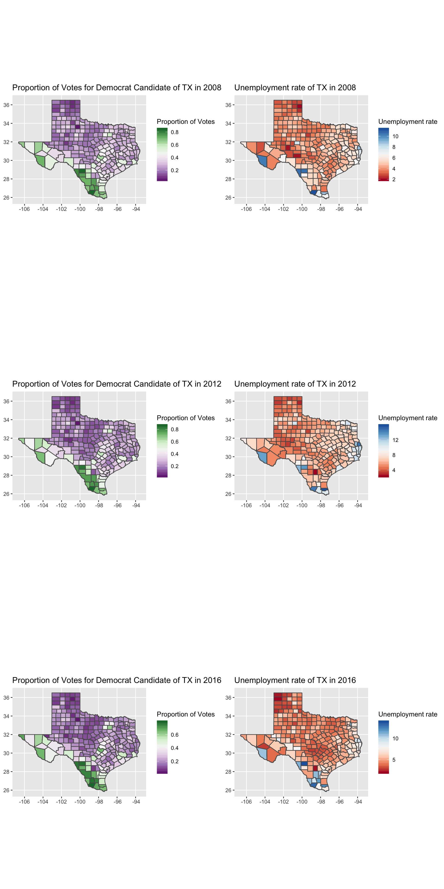
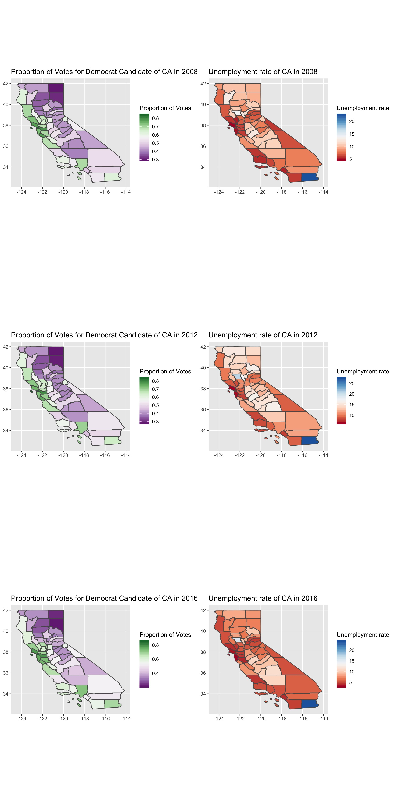
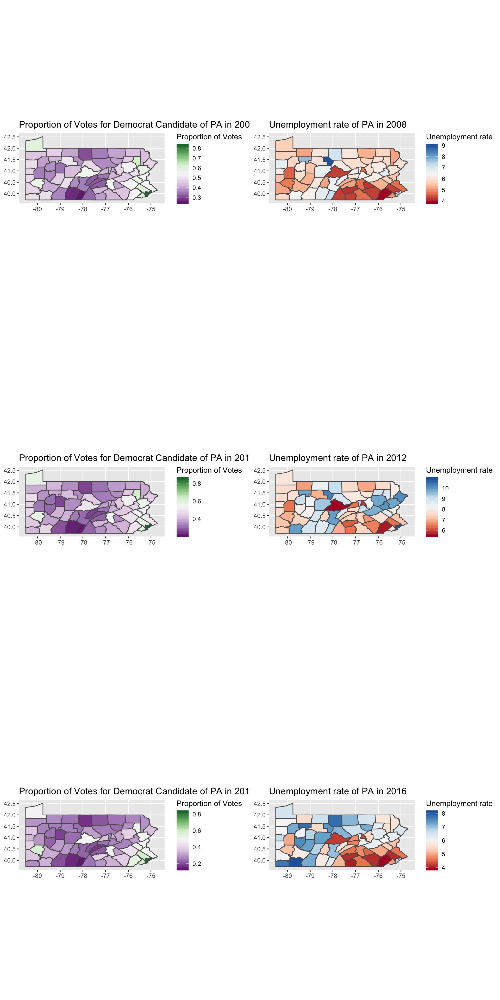

```{r setup, include=FALSE}
library(tidyverse)
library(sf)
library(readxl)
library(spData)
library(sp)
library(gridExtra)
library(ggpubr)
library(jpeg)
```

### In this assignment, we will visualize historical US election data and unemployment rates across US counties using choropleths.


### Taxes
```{r, echo=FALSE}

```

### California

```{r, echo=FALSE}

```

### Pennsylvania

```{r, echo=FALSE}

```


